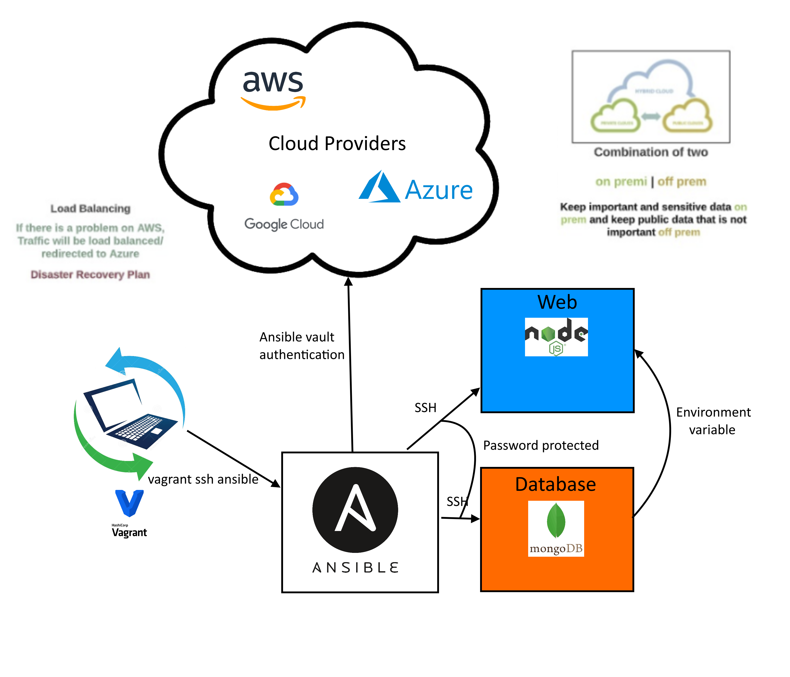
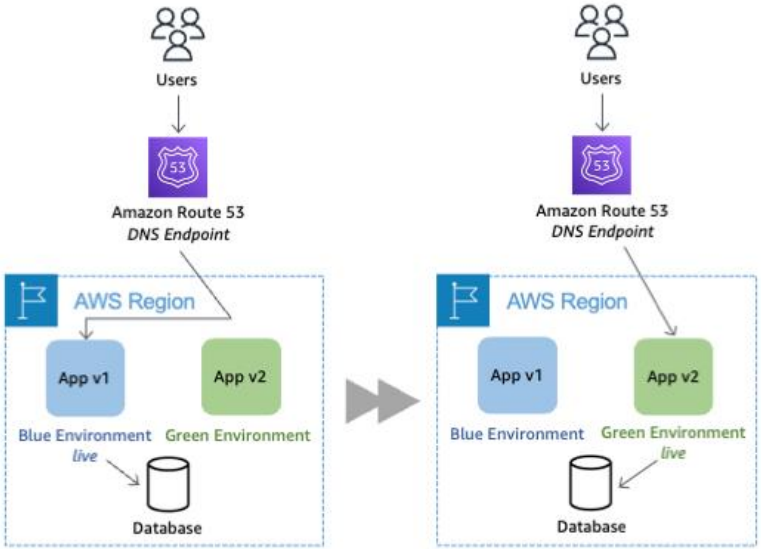

# Infrastructure as code (IaC)
Infrastructure as code (IaC) is the process of managing and provisioning computer data centers through machine-readable definition files, rather than physical hardware configuration or interactive configuration tools.
Practicing infrastructure as code means applying the same rigor of application code development to infrastructure provisioning. All configurations should be defined in a declarative way and stored in a source control system such as AWS CodeCommit, the same as application code. Infrastructure provisioning, orchestration, and deployment should also support the use of the infrastructure as code.


## Configuration Management
Configuration management (CM) is a process for establishing and maintaining consistency of a product's performance, functional, and physical attributes with its requirements, design, and operational information throughout its life.

## Orchestration
Orchestration is the automated configuration, management, and coordination of computer systems, applications, and services. 

## What is Ansible
Ansible is a suite of software tools that enables infrastructure as code. It is open-source and the suite includes software provisioning, configuration management, and application deployment functionality.

Ansible is an open source, command-line IT automation software application written in Python. It can configure systems, deploy software, and orchestrate advanced workflows to support application deployment, system updates, and more.

## Blue-Green Deployment
Blue/green deployments provide releases with near zero-downtime and rollback capabilities. The fundamental idea behind blue/green deployment is to shift traffic between two identical environments that are running different versions of your application. The blue environment represents the current application version serving production traffic. In parallel, the green environment is staged running a different version of your application. After the green environment is ready and tested, production traffic is redirected from blue to green. If any problems are identified, you can roll back by reverting traffic back to the blue environment.

## Setup Ansible with Vagrant
1. SSH into Controller VM
2. Run Update and Upgrade
3. Run `sudo apt-get install software-properties-common`
4. Run `sudo apt-add-repository ppa:ansible/ansible`
5. Run `sudo apt-get update`
6. Run `sudo apt-get install ansible -y`
7. Check `sudo apt-get install tree`
8. cd into `cd /etc/ansible`
9.  Now we want to ssh into web vm from insode the controller vm
10. Enter `sudo ssh vagrant@192.168.33.10` enter then password `vagrant`
    1.  you should now be inside the web vm
11. To return back to controller enter `exit`
12. Now we want to ssh into web db from insode the controller vm
13. Enter `sudo ssh vagrant@192.168.33.11` enter then password `vagrant`
14. alter hosts file in `/etc/ansible` to have groups (labeled with [])
    1.  create a web and db group and put ips in there
    2.  you should now be able to ping machines
    3.  `sudo ansible all -m ping`


## Inventory
Ansible works against multiple managed nodes or “hosts” in your infrastructure at the same time, using a list or group of lists known as inventory. Once your inventory is defined, you use patterns to select the hosts or groups you want Ansible to run against.

## Ansible roles
Roles let you automatically load related vars, files, tasks, handlers, and other Ansible artifacts based on a known file structure. After you group your content in roles, you can easily reuse them and share them with other users.
### Role directory structure

```yaml
# playbooks
site.yml
webservers.yml
fooservers.yml
roles/
    common/               # this hierarchy represents a "role"
        tasks/            #
            main.yml      #  <-- tasks file can include smaller files if warranted
        handlers/         #
            main.yml      #  <-- handlers file
        templates/        #  <-- files for use with the template resource
            ntp.conf.j2   #  <------- templates end in .j2
        files/            #
            bar.txt       #  <-- files for use with the copy resource
            foo.sh        #  <-- script files for use with the script resource
        vars/             #
            main.yml      #  <-- variables associated with this role
        defaults/         #
            main.yml      #  <-- default lower priority variables for this role
        meta/             #
            main.yml      #  <-- role dependencies
        library/          # roles can also include custom modules
        module_utils/     # roles can also include custom module_utils
        lookup_plugins/   # or other types of plugins, like lookup in this case

    webtier/              # same kind of structure as "common" was above, done for the webtier role
    monitoring/           # ""
    fooapp/               # ""
```

## Adhoc commands in Ansible

- Run an update on web node from controller node
  - `sudo ansible web -a "sudo apt update -y" `
- Ping nodes
  - ` sudo ansible all -m ping`
## YAML
YAML is a human-friendly data serialization language for all programming languages.
It is used to create configuration files in many laguanges.
We use it for the creation of playbooks for the Ansible controller to interact with other virtual environments.
```yaml
    # Yaml file start ---
    ---
    # create a script to configure nginx in our web server

    # who is the host - means name of the server
    - hosts: web

    # gather data
    gather_facts: yes

    # we need admin access
    become: true

    # add the actual instructions
    tasks:
    - name: Install/configure Nginx Web server in web-VM
        apt: pkg=nginx state=present
    #can be absent as well
    # we need to ensure at the end of this script the status of nginx is running
```

## Hybrid

1. 
### Set up dependencies for controller
`sudo apt install python3`
`sudo apt install python3-pip`
`pip3 install awscli`
`pip3 install boto boto3`
`sudo apt upgrade -y`
`alias python=python3`

### Set up Ansible vault
`cd /etc/ansible`
`cd`
`/group_vars/all/pass.yaml` - mkdir is needed
when in this vi editor, enter:
`aws_access_key: my_key`
`aws_secret_key: my_key`
cd to /etc/ansible
`sudo ansible-playbook ec2.yaml --ask-pass --tags create-ec2`